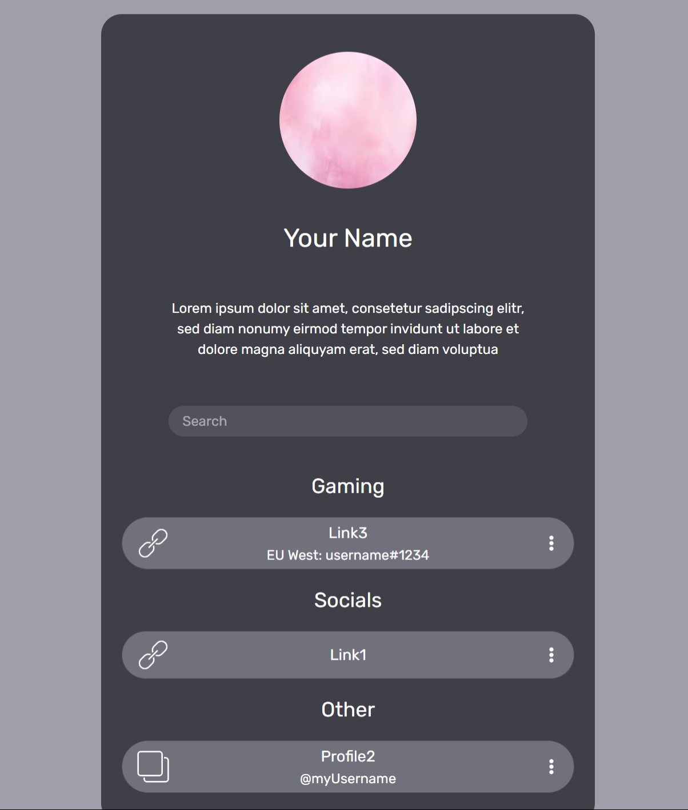

# Linktree

A lightweight, customizable Linktree-style landing page built with HTML, Typescript, React and Tailwind CSS. Share your social media profiles, gamer tags and other important links, so everybody can find them and copy them with a single click of a button.

## Preview

   

## Features

- Responsive design for mobile and desktop
- Search bar to filter your links
- Easy customization
- Fast and lightweight
- Icons for social media and games
- No additional dependencies required
- Context menu to copy link or username with a single click

## Getting Started

1. Clone the repository:
   `git clone https://github.com/dpister/linktree.git`

2. Install [Node JS](https://nodejs.org/en)

3. Run `npm run dev` and open [localhost:5173](http://localhost:5173/) in your browser

4. Rename `sampleContents.tsx` to `contents.tsx`.

5. Customize:
   - Add your own links
   - Update your name and bio
   - Replace `src/assets/profile-picture.png` with your profile picture

## License

This project is licensed under the MIT License.

## Author

Created by Daniel Pister.
